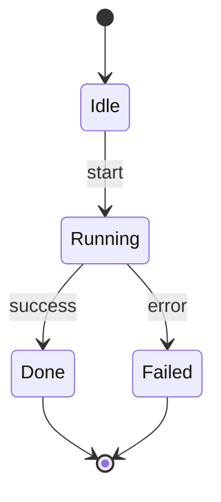

# Design Documentation Skill

You are creating **architecture design documentation** — pure design artifacts
that describe how a system is structured, how components relate, and how they
operate together. These documents represent either the **current target state**
or the **future target state** of the system.

## Core Principles

### What Design Docs ARE

- Architecture and structural descriptions
- Component relationships and interactions
- Data flow and control flow diagrams (Mermaid)
- Interface contracts and boundaries
- Design decisions and their rationale
- Behavioral descriptions of how components operate together

### What Design Docs ARE NOT

- Implementation guides or tutorials
- Code snippets (avoid unless a data structure is truly unique and complex)
- Historical changelogs of what was built when
- Step-by-step implementation plans or phases
- API reference docs (those belong in code-level docs)

### Temporal Rule

Design docs always describe the **target state**:

- If the system exists → the doc describes its current design
- If the system is planned → the doc describes the intended design
- Never describe past states, migration history, or "what we did in phase 1"

## Documentation Structure

### File Organization

Organize docs in a `docs/design/` directory with a hierarchical breakdown that
mirrors the system's component structure:

```
docs/design/
├── README.md              # Index: system overview + links to all sections
├── overview.md            # High-level architecture, key principles, system boundaries
├── <component-a>/
│   ├── README.md          # Component overview + links to sub-topics
│   ├── <sub-topic>.md     # Focused design doc for a specific aspect
│   └── <sub-topic>.md
├── <component-b>/
│   ├── README.md
│   └── ...
└── glossary.md            # Single source of truth for all domain terms
```

**Rules:**

- Each directory has a `README.md` that serves as the entry point and index
- Use subdirectories to mirror the logical component hierarchy
- File names should be descriptive: `state-machine.md`, `node-lifecycle.md`
- Keep individual files focused — one concept or component per file

### DRY Documentation

- **Single source of truth**: Every concept is defined in exactly one place
- **Use hyperlinks**: Reference other docs via relative markdown links instead
  of repeating explanations: `See [Node Behaviour](../nodes/README.md)`
- **glossary.md**: Define domain-specific terms once. Link to glossary entries
  from other docs rather than re-explaining terms
- If you find yourself writing the same explanation twice, extract it to its own
  file and link to it from both locations

### Cross-Referencing

Use relative links to connect documents:

```markdown
The workflow engine uses [Nodes](../nodes/README.md) as its execution units.
Each node follows the [context-in/context-out contract](../nodes/README.md#contract).
For terminology, see the [Glossary](../glossary.md#node).
```

## Content Format

### Prefer Visual Representations

Use **Mermaid diagrams** for:

- Component relationships → `graph` or `flowchart`
- State machines → `stateDiagram-v2`
- Sequences and interactions → `sequenceDiagram`
- Data flow → `flowchart LR`
- Class/type hierarchies → `classDiagram`

Example:

````markdown

````

### Use Tables For

- Comparing options or variants
- Listing component responsibilities
- Mapping interfaces (inputs → outputs)
- Configuration options and their effects
- Dependency matrices

### Use Text For

- Explaining the "why" behind design decisions
- Describing behavioral contracts and invariants
- Documenting constraints and trade-offs
- Narrating how components collaborate in a workflow

### Avoid

- Code snippets (unless showing a truly unique/complex data structure)
- Inline code for anything that could be described in prose or a table
- Implementation-specific details (library versions, function signatures)
- Line-by-line explanations of algorithms

## Writing Style

- **Declarative, present tense**: "The scheduler dispatches tasks to workers"
  (not "The scheduler will dispatch" or "We implemented dispatching")
- **Component as subject**: "The Node behaviour defines..." not "We define..."
- **Precise but accessible**: Technical accuracy without jargon overload
- **Concise**: If a diagram says it, don't repeat it in prose. Add prose only
  for what the diagram can't convey (rationale, constraints, edge cases)

## Process

When creating or updating design documentation:

1. **Understand scope**: Read the relevant source code and existing docs to
   understand what's being documented. Use `$ARGUMENTS` as the topic focus.

2. **Check existing docs**: Look in `docs/design/` for existing documentation.
   Update in place rather than creating duplicates.

3. **Plan the structure**: Determine which files need to be created or updated.
   Ensure they fit the hierarchical structure.

4. **Write docs**: Create the documentation following all principles above.
   Start with the component README if it doesn't exist.

5. **Cross-reference**: Add links to/from related documents. Update the
   top-level `docs/design/README.md` index if new files were added.

6. **Verify DRY**: Check that no concept is explained in multiple places. If
   it is, consolidate to one location and link from others.

Focus on: $ARGUMENTS
