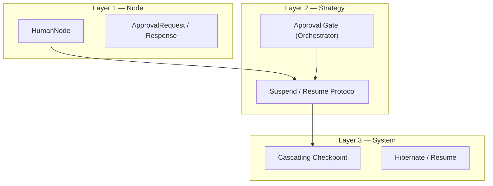

# Human-in-the-Loop (HITL)

Jido Composer treats human decisions as first-class participants in agent flows.
A human approval gate is not a special escape hatch — it is a
[Node](../nodes/README.md) whose computation happens to be performed by a person
rather than code or an LLM. This preserves the uniform
[context-in/context-out](../nodes/context-flow.md) contract and the
[monoidal](../foundations.md) accumulation model.

## Three Layers

HITL support spans three layers, each building on the one below:

| Layer                               | Scope        | Purpose                                                                                                  | Key Concepts                                                  |
| ----------------------------------- | ------------ | -------------------------------------------------------------------------------------------------------- | ------------------------------------------------------------- |
| [Node](human-node.md)               | Leaf-level   | A Node that yields `:suspend` and constructs an [ApprovalRequest](approval-lifecycle.md#approvalrequest) | [HumanNode](human-node.md), ApprovalRequest, ApprovalResponse |
| [Strategy](strategy-integration.md) | Flow-level   | Workflow and Orchestrator strategies recognize suspension, emit directives, and handle resume signals    | SuspendForHuman directive, `:waiting` status, approval gate   |
| [Persistence](persistence.md)       | System-level | Checkpoint and restore entire agent trees across long pauses                                             | ChildRef, hibernate/thaw, top-down resume                     |

## Design Principles

### Humans Are Nodes

A HumanNode implements the [Node behaviour](../nodes/README.md#contract). It
returns `{:ok, context, :suspend}` — a standard outcome that the
[Workflow](../workflow/README.md) transition table routes like any other. The
parent strategy does not need special logic to "know" it is dealing with a
human; it simply handles the `:suspend` outcome.

### Transport Independence

Composer does not dictate how humans interact. The
[SuspendForHuman](strategy-integration.md#suspendforhuman-directive) directive
carries a serializable [ApprovalRequest](approval-lifecycle.md#approvalrequest).
The runtime chooses how to deliver it — PubSub, webhook, email, Slack, CLI
prompt. Resumption arrives as a [Signal](../glossary.md#signal) or a direct
`cmd/3` call, regardless of transport.

### Isolation Across Nesting

When a child agent suspends for human input, the parent does not know or care.
The parent is already in `:waiting` status, blocked on the child result. This
preserves the [composition isolation](../composition.md) property. See
[Nested Propagation](nested-propagation.md) for the full analysis.

### Graceful Resource Management

A flow may pause for seconds or months. The
[persistence layer](persistence.md) provides a hybrid strategy: keep the
process alive for short waits, checkpoint and stop for long ones. A configurable
`hibernate_after` threshold controls the transition.

## Documents

- [HumanNode](human-node.md) — The Node type for human decisions
- [Approval Lifecycle](approval-lifecycle.md) — ApprovalRequest, ApprovalResponse,
  and the request/response protocol
- [Strategy Integration](strategy-integration.md) — How Workflow and Orchestrator
  strategies handle suspension and resumption
- [Persistence](persistence.md) — State checkpointing, serialization, and
  long-pause resource management
- [Nested Propagation](nested-propagation.md) — How HITL interacts with
  recursive composition, concurrent work, and cascading cancellation
