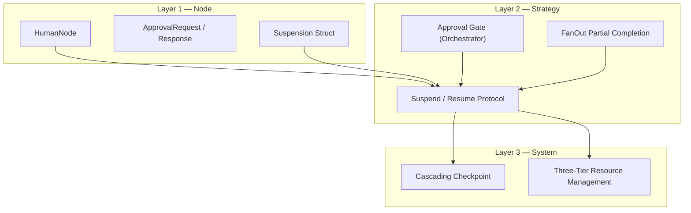

# Suspension and Human-in-the-Loop (HITL)

Jido Composer provides a generalized suspension model. Any node can pause a flow
for any reason — human approval, rate limit backoff, async completion, or
external job processing. Human-in-the-loop is the primary use case, but the
suspension infrastructure is reason-agnostic.

Human decisions are first-class participants in agent flows. A human approval
gate is not a special escape hatch — it is a [Node](../nodes/README.md) whose
computation happens to be performed by a person rather than code or an LLM. This
preserves the uniform [context-in/context-out](../nodes/context-flow.md)
contract and the [monoidal](../foundations.md) accumulation model.

## Generalized Suspension

Any node returning `{:ok, context, :suspend}` triggers suspension. The
`Suspension` struct carries metadata about the pause:

| Field              | Type                         | Purpose                                |
| ------------------ | ---------------------------- | -------------------------------------- |
| `id`               | `String.t()`                 | Unique identifier for correlation      |
| `reason`           | atom                         | Why the flow suspended (see below)     |
| `created_at`       | `DateTime.t()`               | When suspension started                |
| `resume_signal`    | `String.t()` \| nil          | Expected signal type for resumption    |
| `timeout`          | integer \| `:infinity`       | Maximum wait time                      |
| `timeout_outcome`  | atom \| nil                  | Outcome used when timeout fires        |
| `metadata`         | map \| nil                   | Reason-specific data                   |
| `approval_request` | `ApprovalRequest.t()` \| nil | Non-nil only for `:human_input` reason |

### Suspension Reasons

| Reason              | Source                                      | Resume trigger                         |
| ------------------- | ------------------------------------------- | -------------------------------------- |
| `:human_input`      | [HumanNode](human-node.md) or approval gate | Human decision signal                  |
| `:rate_limit`       | Rate-limited tool/action                    | Timer expiry or external retry signal  |
| `:async_completion` | Async external operation                    | Webhook callback or polling completion |
| `:external_job`     | Offloaded computation                       | Job completion signal                  |
| `:custom`           | Application-defined                         | Application-defined resume signal      |

The strategy's `pending_suspension` field replaces the HITL-specific
`pending_hitl_request`. The generalized `Suspend` directive replaces
`SuspendForHuman` as the primary directive (SuspendForHuman remains as a
convenience wrapper for backward compatibility).

## Three Layers

Suspension support spans three layers, each building on the one below:

| Layer                               | Scope        | Purpose                                                                                               | Key Concepts                                                                   |
| ----------------------------------- | ------------ | ----------------------------------------------------------------------------------------------------- | ------------------------------------------------------------------------------ |
| [Node](human-node.md)               | Leaf-level   | A Node that yields `:suspend` and constructs a Suspension or [ApprovalRequest](approval-lifecycle.md) | [HumanNode](human-node.md), Suspension, ApprovalRequest, ApprovalResponse      |
| [Strategy](strategy-integration.md) | Flow-level   | Strategies recognize suspension, emit directives, and handle resume signals                           | Suspend directive, `:waiting` status, approval gate, FanOut partial completion |
| [Persistence](persistence.md)       | System-level | Checkpoint and restore entire agent trees across long pauses                                          | ChildRef, three-tier lifecycle, top-down resume                                |

## Design Principles

### Suspension Is Not an Error

`:suspend` is a positive outcome — the flow is proceeding normally, just with a
pause. It does not route through error transitions. The strategy holds the
[Machine](../workflow/state-machine.md) at the current state and waits for a
resume signal. On resume, the provided outcome (e.g., `:approved`, `:ok`,
`:retry`) is used for transition lookup.

### Humans Are Nodes

A HumanNode implements the [Node behaviour](../nodes/README.md#contract). It
returns `{:ok, context, :suspend}` — a standard outcome that the
[Workflow](../workflow/README.md) transition table routes like any other. The
parent strategy does not need special logic to "know" it is dealing with a
human; it simply handles the `:suspend` outcome.

### Transport Independence

Composer does not dictate how suspension notifications are delivered. The
Suspend directive carries a serializable Suspension struct. The runtime chooses
how to deliver it — PubSub, webhook, email, Slack, timer, CLI prompt.
Resumption arrives as a [Signal](../glossary.md#signal) or a direct `cmd/3`
call, regardless of transport.

### Isolation Across Nesting

When a child agent suspends (for any reason), the parent does not know or care.
The parent is already in `:waiting` status, blocked on the child result. This
preserves the [composition isolation](../composition.md) property. See
[Nested Propagation](nested-propagation.md) for the full analysis.

### Graceful Resource Management

A flow may pause for milliseconds or months. The
[persistence layer](persistence.md) provides a three-tier strategy: keep the
process alive for short waits, OTP-hibernate for medium waits, and fully
checkpoint and stop for long ones.

## Documents

- [HumanNode](human-node.md) — The Node type for human decisions
- [Approval Lifecycle](approval-lifecycle.md) — ApprovalRequest, ApprovalResponse,
  and the request/response protocol
- [Strategy Integration](strategy-integration.md) — How Workflow and Orchestrator
  strategies handle suspension and resumption, including FanOut partial completion
- [Persistence](persistence.md) — Three-tier resource management, checkpointing,
  serialization, and hibernate/thaw across long pauses
- [Nested Propagation](nested-propagation.md) — Suspension across recursive
  composition, concurrent work, and cascading cancellation
