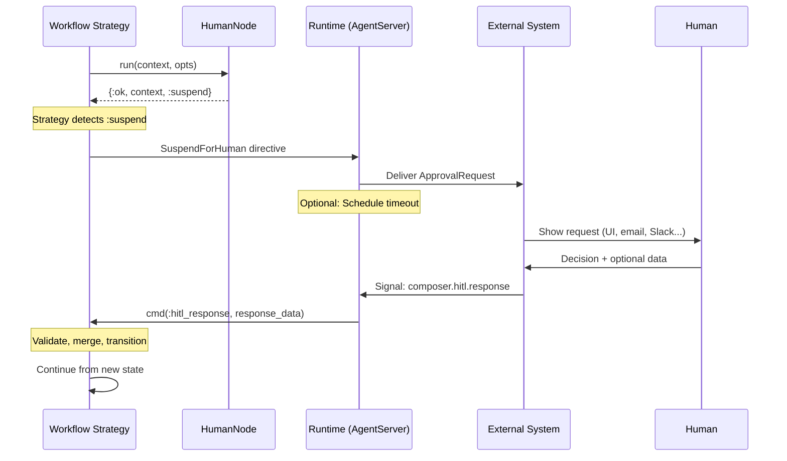

# Approval Lifecycle

The approval lifecycle is the protocol by which a flow suspends, a human
receives a request, and the flow resumes with the human's decision.

## Data Structures

### ApprovalRequest

A serializable struct representing a pending human decision. Constructed by the
[HumanNode](human-node.md) and enriched by the
[strategy](strategy-integration.md) with flow identification.

| Field               | Type                           | Set By    | Purpose                                               |
| ------------------- | ------------------------------ | --------- | ----------------------------------------------------- |
| `id`                | `String.t()`                   | HumanNode | Unique request identifier for correlation             |
| `prompt`            | `String.t()`                   | HumanNode | Human-readable question                               |
| `visible_context`   | `map()`                        | HumanNode | Subset of flow context the human should see           |
| `allowed_responses` | `[atom()]`                     | HumanNode | Outcome atoms the human can choose from               |
| `response_schema`   | keyword \| nil                 | HumanNode | Schema for structured input beyond the outcome        |
| `timeout`           | `pos_integer()` \| `:infinity` | HumanNode | Maximum wait time in milliseconds                     |
| `timeout_outcome`   | `atom()`                       | HumanNode | Outcome atom when timeout fires                       |
| `metadata`          | `map()`                        | HumanNode | Arbitrary metadata for the notification system        |
| `created_at`        | `DateTime.t()`                 | HumanNode | When the request was created                          |
| `agent_id`          | `String.t()`                   | Strategy  | ID of the suspended agent                             |
| `agent_module`      | `module()`                     | Strategy  | Module of the suspended agent                         |
| `workflow_state`    | `atom()` \| nil                | Strategy  | Current FSM state name (Workflow only)                |
| `tool_call`         | `map()` \| nil                 | Strategy  | The tool call that triggered this (Orchestrator only) |
| `node_name`         | `String.t()`                   | Strategy  | Name of the HumanNode or gated node                   |

The struct contains no PIDs, closures, or process references. It can be
persisted alongside the agent checkpoint, sent over the wire, or displayed in
any UI.

### ApprovalResponse

The human's response, constructed by external code and delivered to the
suspended flow.

| Field          | Type                | Purpose                                              |
| -------------- | ------------------- | ---------------------------------------------------- |
| `request_id`   | `String.t()`        | Must match the ApprovalRequest `id`                  |
| `decision`     | `atom()`            | One of the `allowed_responses` atoms                 |
| `data`         | `map()` \| nil      | Structured input validated against `response_schema` |
| `respondent`   | `term()`            | Who responded (opaque — user ID, email, etc.)        |
| `comment`      | `String.t()` \| nil | Optional free-text comment                           |
| `responded_at` | `DateTime.t()`      | When the response was provided                       |

## Lifecycle Flow



## Request-Response Correlation

Every ApprovalRequest carries a unique `id` (generated by the HumanNode). When
the human responds, the ApprovalResponse carries the same `id` in `request_id`.
The strategy validates this match before accepting the response — a response
with a mismatched ID is rejected.

This correlation enables:

- Multiple concurrent HITL requests (each with a distinct ID)
- Safe rejection of stale or duplicate responses
- Audit trail linking requests to responses

## Validation on Resume

When a resume signal arrives, the strategy performs three validations before
accepting the response:

| Check       | What                                                          | On Failure                   |
| ----------- | ------------------------------------------------------------- | ---------------------------- |
| Request ID  | `response.request_id == pending_request.id`                   | Reject with validation error |
| Decision    | `response.decision in pending_request.allowed_responses`      | Reject with validation error |
| Data schema | `response.data` conforms to `pending_request.response_schema` | Reject with validation error |

After validation, the strategy:

1. Deep-merges the response data into the flowing context under `hitl_response`
2. Uses `response.decision` as the [outcome](../glossary.md#outcome) for
   transition lookup
3. Clears the pending request from strategy state
4. Resumes normal execution

## Context Enrichment

The human's response is merged into context as:

```
context.hitl_response = %{
  decision:     :approved,
  data:         %{...},       # structured input if any
  respondent:   "user@co.com",
  comment:      "Looks good",
  responded_at: ~U[2026-03-04 10:30:00Z]
}
```

Subsequent nodes can access this data — for example, an audit action might log
the approver's identity and timestamp.
