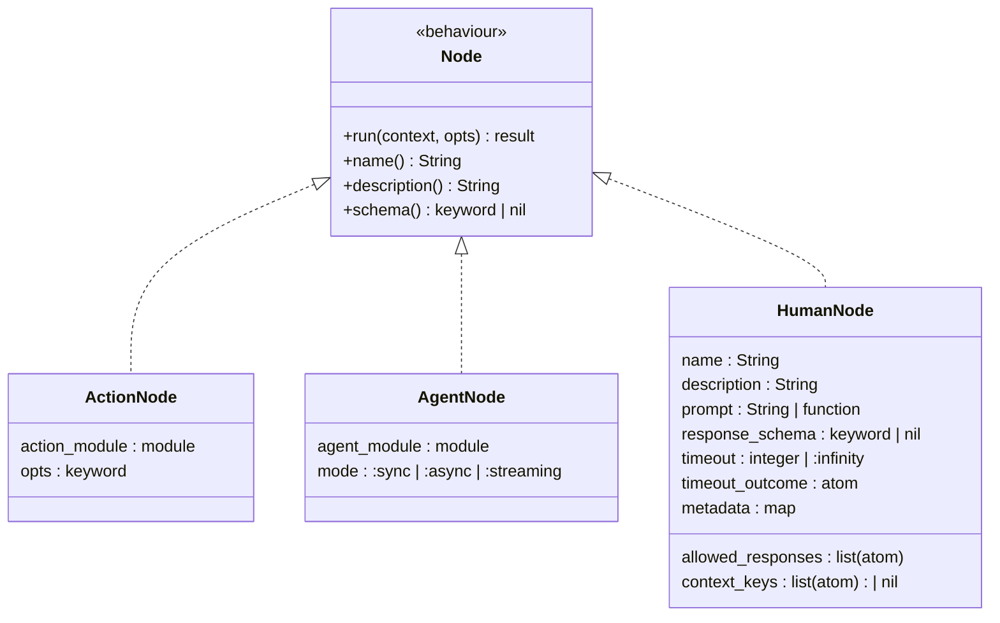

# HumanNode

The third [Node type](../nodes/README.md#node-types), alongside ActionNode and
AgentNode. A HumanNode represents a point in a flow where a human must provide
input before execution can continue.

## Position in the Node Hierarchy



## Struct Fields

| Field               | Type                               | Default                  | Purpose                                                                       |
| ------------------- | ---------------------------------- | ------------------------ | ----------------------------------------------------------------------------- |
| `name`              | `String.t()`                       | required                 | Node identifier                                                               |
| `description`       | `String.t()`                       | required                 | What this node asks the human                                                 |
| `prompt`            | `String.t()` or `(context -> str)` | required                 | The question presented to the human; may be a function of context             |
| `allowed_responses` | `[atom()]`                         | `[:approved, :rejected]` | Outcome atoms the human can choose from                                       |
| `response_schema`   | keyword \| nil                     | nil                      | Zoi schema for structured input beyond the outcome atom                       |
| `timeout`           | `pos_integer()` \| `:infinity`     | `:infinity`              | Maximum wait time in milliseconds                                             |
| `timeout_outcome`   | `atom()`                           | `:timeout`               | Outcome used when the timeout fires                                           |
| `context_keys`      | `[atom()]` \| nil                  | nil (all keys)           | Which context keys to include in the [ApprovalRequest](approval-lifecycle.md) |
| `metadata`          | `map()`                            | `%{}`                    | Arbitrary metadata forwarded to the notification system                       |

## Behaviour

When `run/2` is called, a HumanNode:

1. Evaluates the `prompt` (static string or function applied to context)
2. Filters the context down to `context_keys` (if configured)
3. Constructs an [ApprovalRequest](approval-lifecycle.md#approvalrequest)
4. Places the request in context under `__approval_request__`
5. Returns `{:ok, updated_context, :suspend}`

The HumanNode never blocks or waits. It returns immediately with the `:suspend`
outcome. The [strategy layer](strategy-integration.md) interprets `:suspend` as
a signal to pause the flow and emit a
[SuspendForHuman](strategy-integration.md#suspendforhuman-directive) directive.

## The `:suspend` Outcome

`:suspend` is a reserved [outcome](../glossary.md#outcome) with special
semantics:

| Outcome     | Strategy Behaviour                                           |
| ----------- | ------------------------------------------------------------ |
| `:ok`       | Look up transition, advance to next state                    |
| `:error`    | Look up error transition (or wildcard)                       |
| `:suspend`  | Pause the flow, emit SuspendForHuman, wait for resume signal |
| custom atom | Look up transition normally                                  |

The strategy does **not** look up a transition for `:suspend`. Instead, it holds
the [Machine](../workflow/state-machine.md) at the current state and waits for a
resume signal. When the resume arrives, the human's decision atom (e.g.,
`:approved`) is used as the transition outcome.

## Usage in Workflow DSL

A HumanNode is declared in the nodes map like any other node. The transition
table references the `allowed_responses` outcomes:

```
nodes: %{
  process:  ProcessAction,
  approval: {HumanNode, prompt: "Approve?", allowed_responses: [:approved, :rejected]},
  execute:  ExecuteAction
},
transitions: %{
  {:process, :ok}        => :approval,
  {:approval, :approved} => :execute,
  {:approval, :rejected} => :failed,
  {:approval, :timeout}  => :failed,
  {:execute, :ok}        => :done
}
```

The FSM graph makes the human decision point explicitly visible — it is a state
with named outgoing transitions, not a hidden side-channel.

## Usage in Orchestrator DSL

In an Orchestrator, a HumanNode can be registered as a tool that the LLM calls
to proactively request human guidance. This is complementary to the
[approval gate](strategy-integration.md#orchestrator-approval-gate), which is
an enforcement mechanism:

| Mechanism         | Who Triggers      | Enforcement | Purpose                                           |
| ----------------- | ----------------- | ----------- | ------------------------------------------------- |
| HumanNode as tool | LLM decides       | Advisory    | LLM asks for help when uncertain                  |
| Approval gate     | Strategy enforces | Mandatory   | Dangerous tools require approval before execution |

## Design Decisions

**Why a separate Node type rather than a wrapper around existing nodes?**

A wrapper (`approval_gate(SomeAction, ...)`) conflates two concerns: the
approval gate and the guarded action. A single FSM state would have two phases,
making transition semantics ambiguous. Does `:approved` mean the human approved,
or the action succeeded? Separating them into distinct states keeps the FSM
clean.

**Why `:suspend` instead of returning `{:error, :needs_approval}`?**

Suspension is not an error — the flow is proceeding normally, just with a human
step. Using an error outcome would route through error transitions and
compensation logic. `:suspend` is a positive outcome that says "I produced a
result (the ApprovalRequest) and the flow should pause."

**Why dynamic prompts?**

The prompt often needs to reference accumulated context: "Approve deployment of
build v1.2.3 to production?" A function prompt `(context -> string)` enables
this without requiring the developer to pre-compute the prompt in a prior state.
