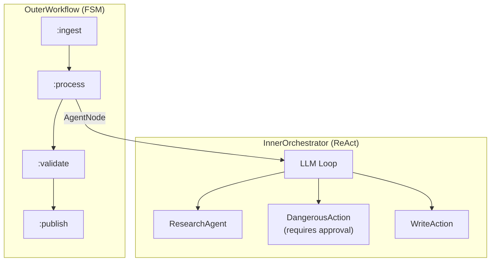
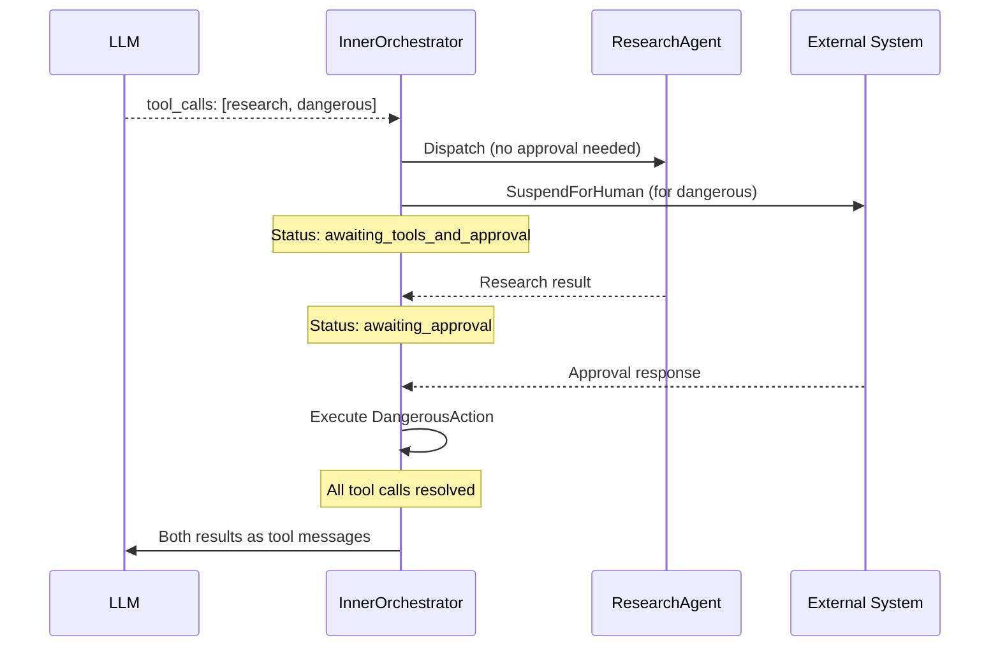
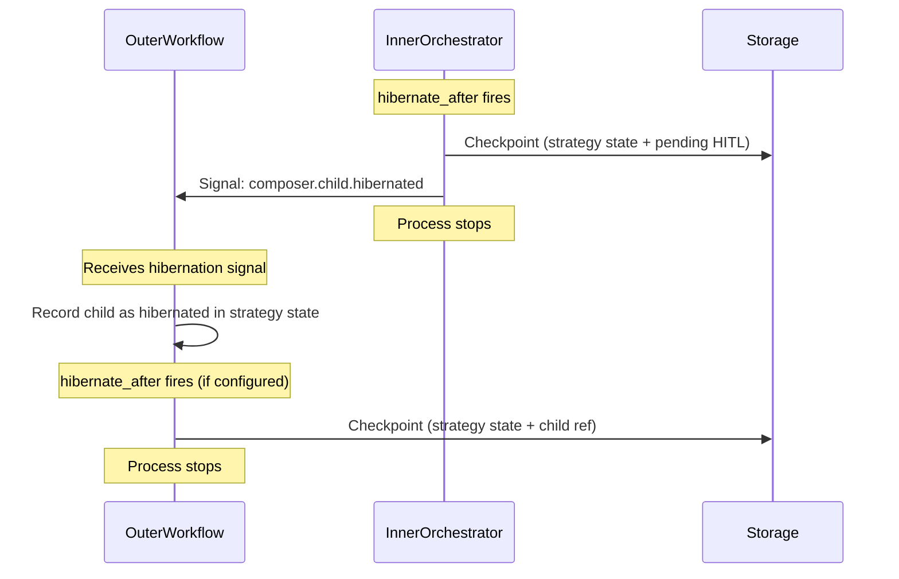
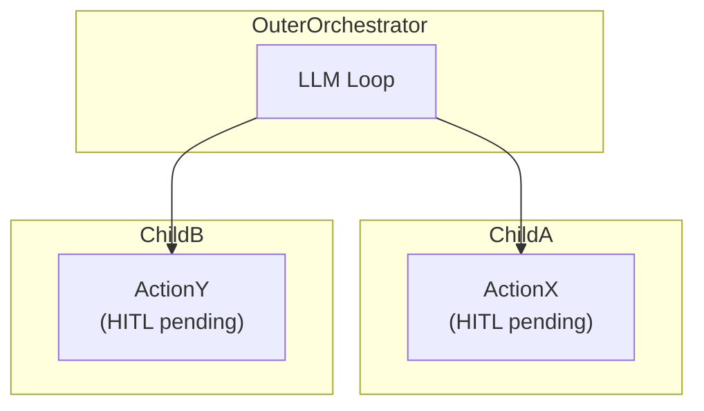
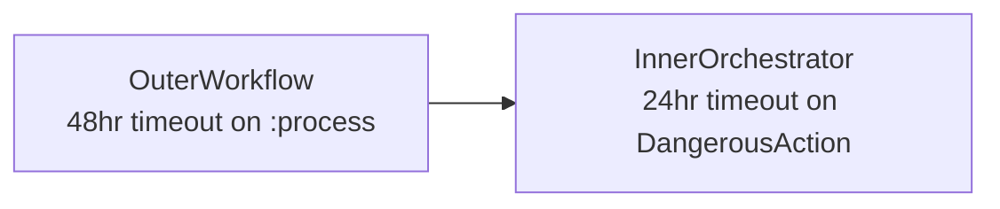

# Nested Propagation

This document analyzes how HITL interacts with
[recursive composition](../composition.md) — nested agent trees, concurrent
tool calls, and cascading state management.

## Reference Scenario

The following nested flow is used throughout this analysis:

OuterWorkflow is at state `:process`, which has spawned InnerOrchestrator as a
child agent. The InnerOrchestrator's LLM has returned two tool calls:
ResearchAgent and DangerousAction (which requires approval).

## Isolation Property

The parent does not know the child is paused. This is by design — the
[composition model](../composition.md) guarantees that each child runs its own
strategy independently, and the parent only sees the final result.

When InnerOrchestrator suspends for approval:

| Agent             | Status                                 | Knowledge of Pause              |
| ----------------- | -------------------------------------- | ------------------------------- |
| OuterWorkflow     | `:waiting` (blocked on child result)   | None — it was already waiting   |
| InnerOrchestrator | `:waiting` (HITL pending)              | Full — owns the ApprovalRequest |
| External system   | Notified via SuspendForHuman directive | Receives the ApprovalRequest    |

The OuterWorkflow's strategy state is unchanged by the inner pause. It simply
continues waiting for the child result signal, which it would have been waiting
for regardless.

## Concurrent Work During Pause

When the LLM returns both ResearchAgent (no approval) and DangerousAction
(approval required), the Orchestrator
[partitions the tool calls](strategy-integration.md#tool-call-partitioning):

ResearchAgent runs to completion while the approval is pending. Its result is
stored in the strategy's `completed_tool_results`. The flow does not wait for
approval before starting non-gated work.

If ResearchAgent errors while approval is pending, the error result is also
stored. When all tool calls resolve (completed, rejected, or errored), the
strategy assembles all results and calls the LLM for the next iteration.

## Cascading Checkpoint

When the `hibernate_after` threshold fires during a HITL pause, the agent tree
checkpoints from the inside out:

The child checkpoints first because it holds the HITL-specific state. The parent
then records the child's hibernation and may checkpoint itself. See
[Persistence](persistence.md) for the checkpoint structure and resume protocol.

## Cascading Cancellation

When a human rejects DangerousAction, the rejection is handled within
InnerOrchestrator. The
[rejection policy](strategy-integration.md#rejection-policy-for-sibling-tool-calls)
determines what happens to sibling tool calls:

| Policy               | ResearchAgent (still running)               | OuterWorkflow                                      |
| -------------------- | ------------------------------------------- | -------------------------------------------------- |
| `:continue_siblings` | Finishes normally                           | Sees normal or error result from InnerOrchestrator |
| `:cancel_siblings`   | Receives StopChild; synthetic cancel result | Sees normal or error result from InnerOrchestrator |
| `:abort_iteration`   | Receives StopChild                          | Sees error result from InnerOrchestrator           |

In all cases, the rejection is **internalized** within InnerOrchestrator. The
OuterWorkflow sees either a successful result (the LLM adapted to the rejection)
or an error result (the LLM could not recover). The rejection itself does not
produce a special outcome type — it is just another input to the LLM's
reasoning.

## Multiple HITL Points at Different Levels

Within a single Workflow (sequential FSM), two HITL states cannot be active
simultaneously — the [Machine](../workflow/state-machine.md) has a single
`status` field. HITL gates execute in sequence like any other state.

In an Orchestrator that spawns multiple children, independent HITL requests
can be active simultaneously:

Each HITL request has a unique `id`. They resume independently:

1. Human approves ActionX -> ChildA completes -> result stored
2. OuterOrchestrator still waiting for ChildB
3. Human approves ActionY -> ChildB completes -> result stored
4. All tool calls resolved -> OuterOrchestrator proceeds

If ActionX is approved but ActionY is rejected, the Orchestrator receives
one real result and one synthetic rejection. The LLM adapts to the partial
success.

## Timeout Interaction with Nesting

Timeouts at different levels are independent:

| Event                   | Time   | Effect                                                             |
| ----------------------- | ------ | ------------------------------------------------------------------ |
| DangerousAction timeout | T+24hr | InnerOrchestrator uses timeout outcome; LLM adapts or fails        |
| OuterWorkflow timeout   | T+48hr | Only fires if InnerOrchestrator hasn't completed; issues StopChild |

If the outer timeout fires first (e.g., outer is 12hr, inner is 24hr):

1. OuterWorkflow issues StopChild for InnerOrchestrator
2. InnerOrchestrator terminates
3. OuterWorkflow treats this as an error outcome on `:process`
4. The HITL request in the external system should be marked as cancelled

## Race Conditions and Mitigations

| Race Condition                                  | Mitigation                                                                                    |
| ----------------------------------------------- | --------------------------------------------------------------------------------------------- |
| Approval arrives while agent is hibernating     | External system queues the response; delivered after thaw                                     |
| Duplicate response for same request             | Strategy checks pending request ID; ignores if already resolved                               |
| Child crashes while parent processes approval   | Parent receives `child_exit` signal; marks tool call as failed                                |
| Parent stops child while child sends result     | `emit_to_parent` to dead PID is a no-op; parent receives `child_exit`                         |
| Timeout fires after manual resolution           | Strategy checks if request is still pending; ignores if resolved                              |
| Resume after hibernate but LLM context is stale | Semantic issue, not technical — flow resumes correctly; application may add a staleness check |

## Observability

The [Snapshot](../glossary.md#snapshot) mechanism provides visibility into HITL
state without breaking isolation:

| Snapshot Field | Content During HITL Pause                                                                      |
| -------------- | ---------------------------------------------------------------------------------------------- |
| `status`       | `:waiting`                                                                                     |
| `done?`        | `false`                                                                                        |
| `result`       | `nil`                                                                                          |
| `details`      | `%{reason: :awaiting_approval, request_id: "...", node_name: "...", waiting_since: timestamp}` |

An external monitoring system can poll snapshots to discover paused flows,
display pending approval requests, and track wait durations — all without
directly inspecting strategy internals.
