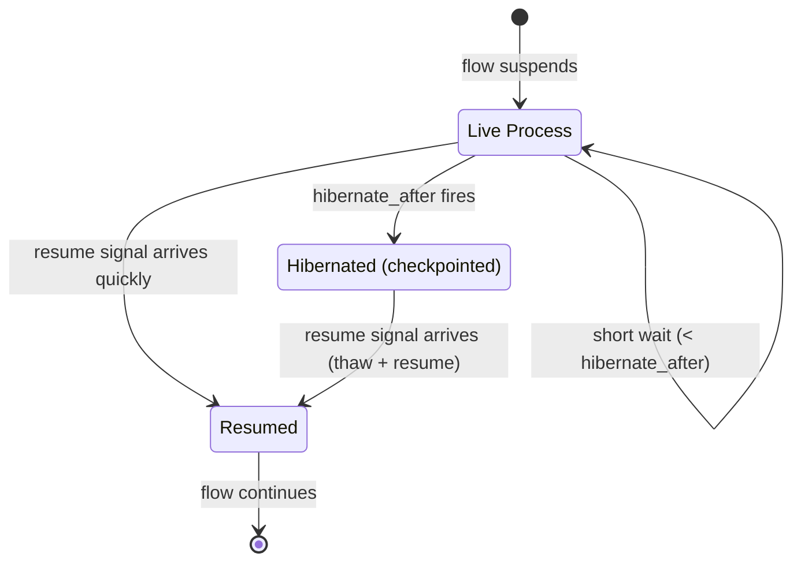
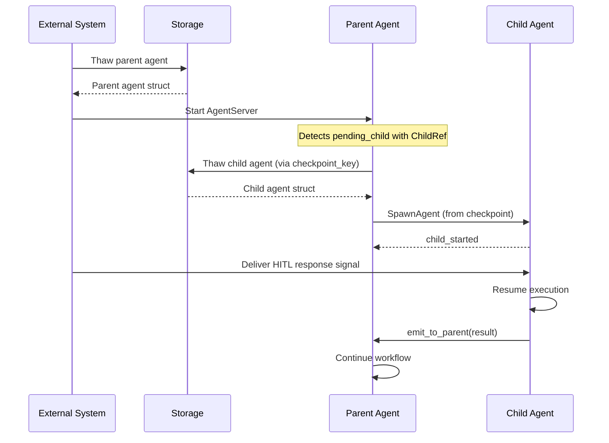

# Persistence

When a flow suspends for human input, the pause may last seconds or months.
This document describes how agent state is preserved across long pauses and
how flows resume after process termination.

## Hybrid Lifecycle Strategy

| Phase      | Process State                      | Resource Cost           | Resume Latency            |
| ---------- | ---------------------------------- | ----------------------- | ------------------------- |
| Live wait  | GenServer alive, `:waiting` status | Memory for agent struct | Instant (signal delivery) |
| Hibernated | Process stopped, state in storage  | Zero (storage only)     | Thaw + process start      |

The `hibernate_after` threshold (default: 5 minutes) controls the transition
from live wait to hibernation. When the threshold fires, the strategy emits
directives to checkpoint state and stop the process. A shorter threshold saves
memory at the cost of resume latency; a longer one favours responsiveness.

## What Gets Checkpointed

The entire agent state — including strategy state under `__strategy__` — is
persisted via `Jido.Persist.hibernate/2`. The checkpoint captures the logical
state of the computation at the moment of suspension.

| Data                                        | Location                            | Serializable?                                                   |
| ------------------------------------------- | ----------------------------------- | --------------------------------------------------------------- |
| Machine status, context, history            | `__strategy__.machine`              | Yes (atoms, maps, timestamps)                                   |
| Orchestrator conversation, tools, iteration | `__strategy__.*`                    | Yes (LLM module must ensure conversation state is serializable) |
| Pending ApprovalRequest                     | `__strategy__.pending_hitl_request` | Yes (no PIDs)                                                   |
| Execution thread                            | Stored separately via Thread        | Yes (append-only log)                                           |
| Child process PIDs                          | `__parent__`, AgentServer children  | **No** — replaced by ChildRef                                   |

## ParentRef PID Handling

The `__parent__` field in child agent state contains a
`Jido.AgentServer.ParentRef` struct with a `pid` field that is not serializable.
The `emit_to_parent/3` helper requires this PID to function. During
checkpointing, the `pid` field must be stripped (set to `nil`). On resume, the
parent re-spawns the child via `SpawnAgent`, which re-populates `__parent__`
with a fresh `ParentRef` pointing to the new parent PID. The `id`, `tag`, and
`meta` fields in `ParentRef` ARE serializable and are preserved across
checkpoint/restore.

## ChildRef: Serializable Child References

The strategy layer never stores raw PIDs. When checkpointing, process-level
references are replaced with serializable `ChildRef` structs:

| Field            | Type         | Purpose                                              |
| ---------------- | ------------ | ---------------------------------------------------- |
| `agent_module`   | `module()`   | The child's agent module (for re-spawning)           |
| `agent_id`       | `String.t()` | The child's unique ID                                |
| `tag`            | `term()`     | The tag used for parent-child tracking               |
| `checkpoint_key` | `term()`     | Storage key for the child's own checkpoint           |
| `status`         | atom         | `:running` \| `:paused` \| `:completed` \| `:failed` |

On resume, the strategy emits a SpawnAgent directive with the `checkpoint_key`,
telling the runtime to restore the child from its checkpoint rather than
creating a fresh agent.

## Checkpoint Structure

A Composer checkpoint extends the base `Jido.Persist` format:

| Field                  | Source       | Purpose                                            |
| ---------------------- | ------------ | -------------------------------------------------- |
| `version`              | Jido.Persist | Schema version for migration                       |
| `checkpoint_schema`    | Composer     | `:composer_workflow` or `:composer_orchestrator`   |
| `agent_module`         | Jido.Persist | The agent's module                                 |
| `id`                   | Jido.Persist | The agent's unique ID                              |
| `status`               | Composer     | `:hibernated` \| `:resuming` \| `:resumed`         |
| `state`                | Jido.Persist | Full `agent.state` including `__strategy__`        |
| `thread`               | Jido.Persist | Thread pointer `{id, rev}`                         |
| `children_checkpoints` | Composer     | Map of `tag => checkpoint_key` for nested children |

## Serialization Format

Checkpoints use Erlang term serialization (`:erlang.term_to_binary/2` with
`:compressed`). This is the format already used by `Jido.Storage.File` and
preserves atoms, module references, and nested data structures natively.

JSON and MsgPack serialization (via jido_signal) are available for export but
are not the primary checkpoint format, as they require atom-to-string mapping
and lose type fidelity.

## Top-Down Resume Protocol

When resuming a checkpointed agent tree, restoration proceeds top-down:

1. The outermost agent is thawed first and started in a new AgentServer
2. The strategy inspects its `ChildRef` entries and re-spawns children from
   their checkpoints
3. Each child is started with a fresh PID and a new `__parent__` reference
   pointing to the (new) parent PID
4. The HITL response signal is delivered to the innermost suspended agent
5. Results propagate upward through the normal `emit_to_parent` mechanism

## Idempotent Resume

To prevent duplicate resumption, checkpoints carry a `status` field:

| Status        | Meaning                  | Transition                     |
| ------------- | ------------------------ | ------------------------------ |
| `:hibernated` | Available for resume     | -> `:resuming` on thaw         |
| `:resuming`   | Currently being restored | -> `:resumed` on completion    |
| `:resumed`    | Already restored         | Reject further resume attempts |

The storage layer provides an atomic compare-and-swap for status transitions.
If a resume attempt finds the checkpoint already in `:resuming` or `:resumed`
state, it returns `{:error, :already_resumed}`.

As a secondary defence, the Thread's monotonic revision counter prevents stale
replays: if a resumed agent has appended new Thread entries, a second resume
attempt finds a revision mismatch.

## Schema Evolution

Code may change between suspension and resumption. The checkpoint's `version`
field enables migration:

| Scenario                           | Handling                                                   |
| ---------------------------------- | ---------------------------------------------------------- |
| New fields added to strategy state | Default values applied during restore                      |
| Fields removed                     | Ignored during restore                                     |
| Transition table changed           | Agent module's `restore/2` callback maps old states to new |
| Module renamed or removed          | Restore fails with clear error; requires manual migration  |

Agent modules implement `checkpoint/2` and `restore/2` callbacks (from
`Jido.Persist`) for custom serialization and version migration logic.

## Handling In-Flight Operations

At checkpoint time, some operations may be in-flight:

| In-Flight Operation                    | Handling                                                                    |
| -------------------------------------- | --------------------------------------------------------------------------- |
| RunInstruction emitted, result pending | Re-emit on resume (instruction is idempotent or recorded in strategy state) |
| LLM HTTP request in progress           | Lost on process stop; re-issued from conversation history on resume         |
| Signal sent but not delivered          | Lost; strategy's phase tracking determines what to re-send                  |
| Child agent still executing            | Stopped before parent checkpoints (or checkpointed independently)           |

The strategy tracks its phase within child communication to determine what to
replay on resume:

| Phase              | On Resume                           |
| ------------------ | ----------------------------------- |
| `:spawning`        | Re-emit SpawnAgent                  |
| `:started`         | Re-send context signal              |
| `:context_sent`    | Re-send context signal (idempotent) |
| `:awaiting_result` | Re-spawn child from checkpoint      |

## External Timeout Management

`Schedule` directives do not survive process death. For HITL flows with long
timeouts, the timeout must be managed externally:

1. The ApprovalRequest includes a `timeout` and `created_at`
2. An external scheduler (cron, database trigger, separate process) checks for
   expired requests
3. On expiry: if the agent is alive, deliver the timeout signal directly; if
   hibernated, thaw and deliver
4. If the agent's checkpoint no longer exists, mark the request as expired

This places timeout management outside jido_composer, which is appropriate
since the library is transport-agnostic and does not mandate a specific
scheduling infrastructure.
