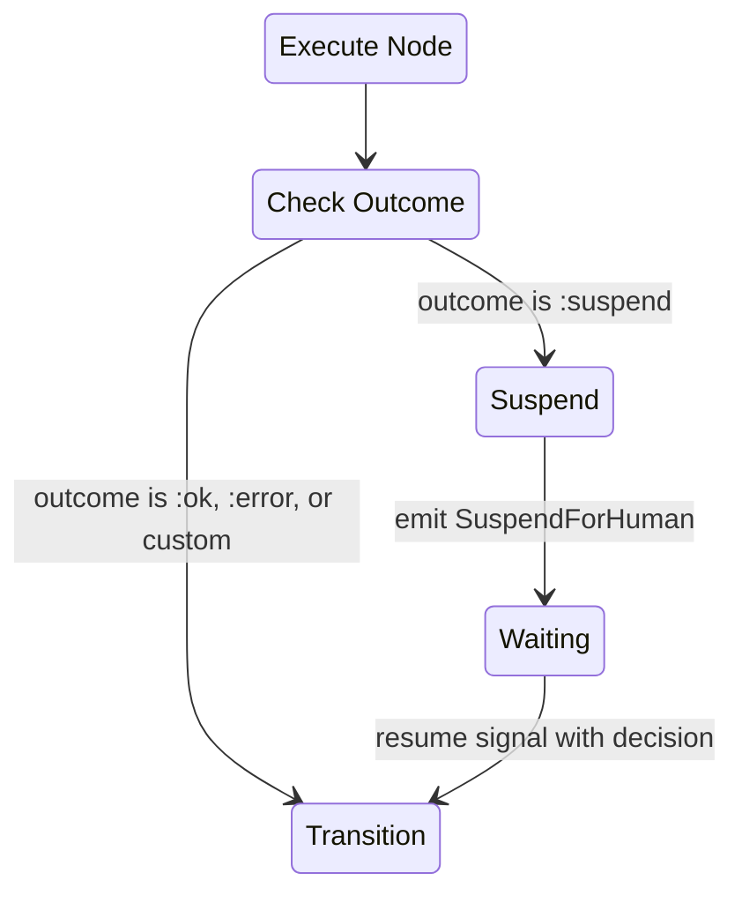
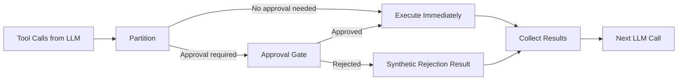

# Strategy Integration

Both the [Workflow](../workflow/README.md) and
[Orchestrator](../orchestrator/README.md) strategies handle HITL through the
same suspend/resume protocol, with pattern-specific extensions.

## SuspendForHuman Directive

A new [directive](../glossary.md#directive) emitted by strategies when a flow
suspends for human input:

| Field              | Type                  | Purpose                                                                      |
| ------------------ | --------------------- | ---------------------------------------------------------------------------- |
| `approval_request` | `ApprovalRequest.t()` | The fully-enriched request (see [Approval Lifecycle](approval-lifecycle.md)) |
| `notification`     | config \| nil         | How to deliver the request (PubSub, webhook, etc.)                           |
| `hibernate`        | `boolean()` \| config | Whether to checkpoint the agent after suspending                             |

The runtime interprets this directive to:

1. Deliver the ApprovalRequest through the configured notification channel
2. Optionally start a timeout timer via a Schedule directive
3. Optionally hibernate the agent (see [Persistence](persistence.md))

## Signal Routes

Both strategies declare routes for HITL signals:

| Signal Type              | Target                            | Purpose                  |
| ------------------------ | --------------------------------- | ------------------------ |
| `composer.hitl.response` | `{:strategy_cmd, :hitl_response}` | Human's decision arrived |
| `composer.hitl.timeout`  | `{:strategy_cmd, :hitl_timeout}`  | Approval timeout fired   |

These routes sit alongside the existing strategy routes (e.g.,
`composer.workflow.start`, `composer.orchestrator.query`).

## Workflow Strategy

### Suspend Handling

When the Workflow strategy executes a node and receives
`{:ok, context, :suspend}`:



1. Extract the [ApprovalRequest](approval-lifecycle.md#approvalrequest) from
   `context.__approval_request__`
2. Enrich the request with flow identification (`agent_id`, `workflow_state`,
   `node_name`)
3. Deep-merge the remaining context into the
   [Machine](../workflow/state-machine.md) (excluding `__approval_request__`)
4. Set strategy status to `:waiting`
5. Store the pending request in strategy state
6. Emit directives: SuspendForHuman + optional Schedule for timeout

### Resume Handling

When `cmd(:hitl_response, response_data)` arrives:

1. Validate the response (see [Approval Lifecycle](approval-lifecycle.md#validation-on-resume))
2. Merge the response into Machine context
3. Use `response.decision` as the outcome for
   [transition lookup](../workflow/state-machine.md)
4. Set status back to `:running`
5. Clear the pending request
6. Continue executing from the new state

### Timeout Handling

When `cmd(:hitl_timeout, %{request_id: id})` fires:

1. Verify the request is still pending (it may have been answered already)
2. If still pending, use the HumanNode's `timeout_outcome` (default: `:timeout`)
   as the transition outcome
3. Clear the pending request and continue

## Orchestrator Strategy

The Orchestrator has two distinct HITL mechanisms: the
[approval gate](#orchestrator-approval-gate) (mandatory enforcement) and a
HumanNode registered as a [tool](../glossary.md#tool) (advisory, LLM-initiated).

### Orchestrator Approval Gate

An approval gate intercepts tool calls **between** the LLM's decision and tool
execution. It is configured via per-tool metadata and an optional dynamic policy
function.

#### Configuration

Per-tool metadata in the DSL:

```
nodes: [
  {DeployAction, requires_approval: true},
  {DeleteAction, requires_approval: true},
  QueryAction  # no approval needed
]
```

Dynamic policy function (optional, evaluated after static metadata):

```
approval_policy: {MyApp.Policies, :orchestrator_approval, []}
```

The policy function receives `(tool_call, context)` and returns `:proceed` or
`{:require_approval, opts}`.

#### Tool Call Partitioning

When the LLM returns tool calls, the strategy partitions them:



#### Concurrent Tool Calls with Mixed Approval

When a single LLM turn produces both gated and ungated tool calls, the strategy
enters a composite status:

| Status                         | Meaning                                                    |
| ------------------------------ | ---------------------------------------------------------- |
| `:awaiting_tools`              | All dispatched tool calls are executing (no HITL pending)  |
| `:awaiting_approval`           | All executable tools finished; only HITL decisions pending |
| `:awaiting_tools_and_approval` | Some tools executing AND some HITL decisions pending       |

The strategy tracks each tool call individually:

| Tool Call State      | Meaning                                    |
| -------------------- | ------------------------------------------ |
| `:executing`         | Dispatched, awaiting result                |
| `:awaiting_approval` | Held at the approval gate                  |
| `:completed`         | Result received                            |
| `:rejected`          | Human rejected, synthetic result generated |

When all tool calls reach a terminal state (`:completed` or `:rejected`), the
strategy assembles all results into conversation messages and proceeds to the
next LLM call.

#### Rejection Handling

When a human rejects a tool call, the strategy injects a synthetic tool result
into the LLM conversation:

```
Tool result for "deploy": REJECTED by human reviewer. Reason: "Too risky."
Choose a different approach.
```

The LLM sees the rejection as a tool failure and adapts — it may try an
alternative approach, request guidance, or produce a final answer. The rejection
does not terminate the flow.

#### Rejection Policy for Sibling Tool Calls

When one tool call is rejected while siblings are still executing, the strategy
applies a configurable rejection policy:

| Policy                         | Behaviour                                                                                          |
| ------------------------------ | -------------------------------------------------------------------------------------------------- |
| `:continue_siblings` (default) | Let executing tool calls finish; pass all results (including rejection) to LLM                     |
| `:cancel_siblings`             | Cancel in-flight tool calls (StopChild); generate synthetic cancel results; pass everything to LLM |
| `:abort_iteration`             | Cancel everything; emit an error                                                                   |

### HITL DSL Options

Both Workflow and Orchestrator DSL macros accept a `hitl` configuration block:

| Option                    | Type                           | Default              | Purpose                                                          |
| ------------------------- | ------------------------------ | -------------------- | ---------------------------------------------------------------- |
| `notification`            | config                         | nil                  | How to deliver ApprovalRequests (PubSub, webhook, etc.)          |
| `hibernate`               | boolean \| config              | false                | Whether to checkpoint during long pauses                         |
| `hibernate_after`         | `pos_integer()`                | `300_000` (5 min)    | Delay before auto-hibernate                                      |
| `default_timeout`         | `pos_integer()` \| `:infinity` | `:infinity`          | Default timeout for all HumanNodes                               |
| `default_timeout_outcome` | `atom()`                       | `:timeout`           | Default timeout outcome                                          |
| `rejection_policy`        | atom                           | `:continue_siblings` | Orchestrator only: how to handle sibling tool calls on rejection |
