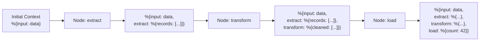
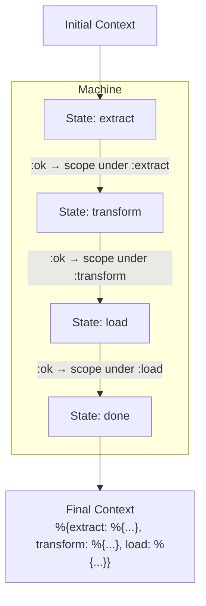

# Context Flow

Context is the data that flows through a composition. Each
[Node](README.md) receives context as input and produces updated context as
output. Results accumulate via **scoped deep merge** — each node's output is
stored under a key derived from its name, preventing cross-node key collisions.

## Scoped Accumulation Model



Each node receives the **full accumulated context** from all preceding nodes.
The node's result is stored under a scope key (the node's name or the workflow
state name) via deep merge. This prevents data loss when multiple nodes produce
values of the same shape (e.g., lists).

## Output Scoping

When a node named `extract` returns `{:ok, %{records: [...], count: 5}}`, the
composition layer stores it as:

```elixir
%{extract: %{records: [...], count: 5}}
```

This scoped result is deep-merged into the accumulated context. Downstream
nodes read from the scope: `context.extract.records`.

| Aspect               | Behaviour                                                  |
| -------------------- | ---------------------------------------------------------- |
| **Scope key**        | Workflow: the state name atom. Orchestrator: the tool name |
| **Input to node**    | Full accumulated context (all scopes visible)              |
| **Output from node** | Raw result map (node does not add its own scope)           |
| **Scoping**          | Applied by the composition layer, not the node itself      |
| **Re-execution**     | Same node re-running overwrites its own scope              |

### Within-Node Accumulation

Because each node receives the full context — including its own previous output
— a node that runs multiple times (e.g., in a loop or retry) can read its
prior result and append to it:

```elixir
def run(context, _opts) do
  previous = context[:my_node][:items] || []
  new_items = do_work()
  {:ok, %{items: previous ++ new_items}}
end
```

The scoping prevents collisions between nodes; within a single node, the author
controls the merge semantics.

## Deep Merge Semantics

Deep merge recursively merges nested maps. Within a scope, this preserves
nested structure:

| Operation                         | Shallow Merge            | Deep Merge                             |
| --------------------------------- | ------------------------ | -------------------------------------- |
| `%{a: %{x: 1}}` + `%{a: %{y: 2}}` | `%{a: %{y: 2}}` (x lost) | `%{a: %{x: 1, y: 2}}` (both preserved) |
| `%{a: 1}` + `%{b: 2}`             | `%{a: 1, b: 2}`          | `%{a: 1, b: 2}` (same)                 |
| `%{a: 1}` + `%{a: 3}`             | `%{a: 3}`                | `%{a: 3}` (same — scalars overwrite)   |

### Non-Map Values

Deep merge treats non-map values (lists, scalars, tuples) as opaque — the
right-hand side replaces the left. `deep_merge(%{items: [1]}, %{items: [2]})`
yields `%{items: [2]}`, not `[1, 2]`. This is safe under scoped accumulation
because each node owns its scope and controls its own list semantics. Cross-node
list collisions cannot occur.

## Mathematical Foundation

Nodes form an **endomorphism monoid** over context maps, composed via Kleisli
arrows:

| Property          | Guarantee                                                           |
| ----------------- | ------------------------------------------------------------------- |
| **Closure**       | A node always produces a map from a map                             |
| **Associativity** | `(A >> B) >> C` = `A >> (B >> C)` — grouping doesn't affect results |
| **Identity**      | A node that returns its input unchanged is the identity element     |

The Kleisli arrow wrapping (`{:ok, map} | {:error, reason}`) provides
short-circuit error handling: if any node returns `{:error, reason}`, the
composition halts.

Scoping strengthens the monoid guarantee: because each node writes to a
distinct key, the merge operation is equivalent to `Map.put` on disjoint keys,
which is trivially associative and avoids the deep merge edge cases with
non-map values.

For the full categorical treatment see [Foundations](../foundations.md).

## Context in Workflows

In a [Workflow](../workflow/README.md), context flows through the
[Machine](../workflow/state-machine.md). The scope key is the **state name**:



The Machine struct holds the accumulated context and updates it after each node
execution. When the machine reaches a [terminal state](../glossary.md#terminal-state),
the accumulated context (with all scopes) is the workflow's result.

## Context in Orchestrators

In an [Orchestrator](../orchestrator/README.md), context accumulates across
iterations of the ReAct loop. Each tool call result is scoped under the
**tool name** (derived from the node's name). The LLM sees the accumulated
context in the conversation history to inform its next decision.

When the LLM calls the same tool multiple times across iterations, the second
call's result overwrites the first under the same scope key. The tool
implementation can read its previous output from context and append if needed.

## Context Across Agent Boundaries

When an [AgentNode](README.md#agentnode) executes, the current context is
serialized into a [Signal](../glossary.md#signal) payload and sent to the child
agent. The child processes this context through its own strategy, then sends
the result back as a signal to the parent. The parent stores the child's result
under the node's scope key in its own context.

This means context crosses process boundaries via signal payloads. The context
must therefore be serializable (plain maps, no PIDs or references).
