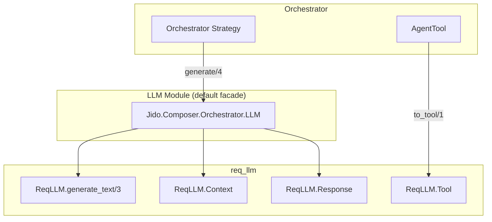
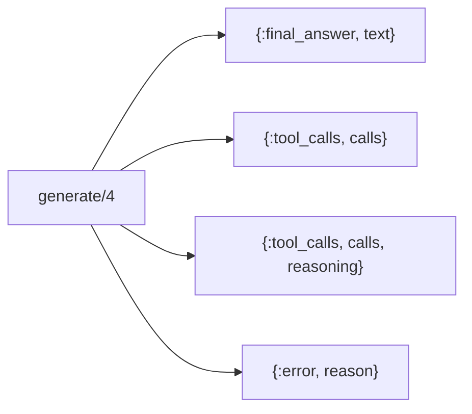
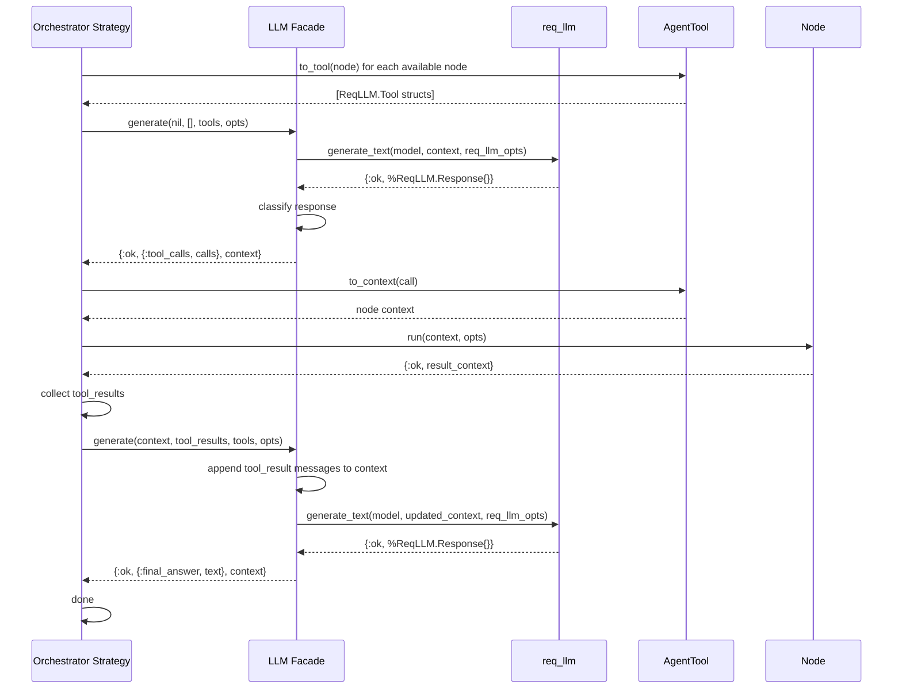
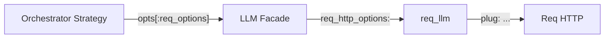

# LLM Integration

The LLM integration layer connects the [Orchestrator](README.md) to language
models via [req_llm](https://hexdocs.pm/req_llm) — a provider-agnostic LLM
library built on Req. The default facade module
(`Jido.Composer.Orchestrator.LLM`) wraps `ReqLLM.generate_text/3` and handles
conversation management, tool description formatting, and response
classification.

## Architecture

The default LLM module is a concrete facade, not an abstract behaviour. Users
can supply custom modules with the same `generate/4` signature — there is no
`@behaviour` or `@callback` enforcement.



## Contract

The LLM module exposes a single function:

| Function     | Input                                   | Output                                                |
| ------------ | --------------------------------------- | ----------------------------------------------------- |
| `generate/4` | conversation, tool_results, tools, opts | `{:ok, response, conversation}` or `{:error, reason}` |

### Parameters

**conversation** (`ReqLLM.Context.t() | nil`) — Conversation history managed by
req_llm. The strategy stores this between calls but never inspects its internal
structure. Pass `nil` on the first call; the facade creates a fresh context.

**tool_results** (`[tool_result()]`) — Normalized results from the previous
round of tool executions. Empty list on the first call.

| Field    | Type         | Description                             |
| -------- | ------------ | --------------------------------------- |
| `id`     | `String.t()` | Tool call ID from the previous response |
| `name`   | `String.t()` | Tool/node name                          |
| `result` | map          | Result map from node execution          |

**tools** (`[ReqLLM.Tool.t()]`) — Tool descriptions as `ReqLLM.Tool` structs,
derived from [Nodes](../nodes/README.md) via
[AgentTool](README.md#agenttool-adapter).

**opts** (`keyword()`) — Options for the LLM call:

| Key              | Type         | Required | Description                                                               |
| ---------------- | ------------ | -------- | ------------------------------------------------------------------------- |
| `:model`         | `String.t()` | Yes      | req_llm model spec (e.g. `"anthropic:claude-sonnet-4-20250514"`)          |
| `:system_prompt` | `String.t()` | No       | System instructions for the LLM                                           |
| `:max_tokens`    | integer      | No       | Maximum tokens in response                                                |
| `:req_options`   | keyword      | No       | Passed as `req_http_options` to req_llm — see [Req Options](#req-options) |

### Response Types

The callback returns `{:ok, response, conversation}` or `{:error, reason}`.

The `conversation` is the updated `ReqLLM.Context` struct that the strategy
stores and passes back on the next call.

The `response` is one of:



| Variant                           | Meaning                                                    |
| --------------------------------- | ---------------------------------------------------------- |
| `{:final_answer, text}`           | The LLM has enough information to respond                  |
| `{:tool_calls, calls}`            | The LLM wants to invoke one or more nodes                  |
| `{:tool_calls, calls, reasoning}` | Tool calls with accompanying reasoning text (e.g., Claude) |
| `{:error, reason}`                | Generation failed                                          |

The `reasoning` string in the 3-tuple variant carries the LLM's thinking text
emitted alongside tool calls. Claude routinely returns both text and tool_use
content blocks in the same response; OpenAI typically returns `content: null`
when making tool calls. The strategy may log or discard this text — it does not
affect execution flow.

**Tool call** structure:

| Field       | Type         | Description                                     |
| ----------- | ------------ | ----------------------------------------------- |
| `id`        | `String.t()` | Unique call identifier (for result correlation) |
| `name`      | `String.t()` | Which tool/node to invoke                       |
| `arguments` | map          | Parameters for the node (always a parsed map)   |

## How the Facade Works

The default facade (`Jido.Composer.Orchestrator.LLM`) performs three steps:

1. **Build context** — Creates or extends a `ReqLLM.Context` from the
   conversation state and incoming tool results. On the first call (`nil`
   conversation), it creates a fresh context with the user query. On subsequent
   calls, it appends tool result messages via `ReqLLM.Context.tool_result/3`.

2. **Call req_llm** — Invokes `ReqLLM.generate_text/3` with the model spec,
   context, and options (system prompt, tools, max tokens, HTTP options).

3. **Classify response** — Uses `ReqLLM.Response.classify/1` to determine
   whether the response contains tool calls or a final answer, then returns the
   standard response tuple.



## Conversation State

The conversation state is a `ReqLLM.Context` struct containing the full message
history. req_llm manages provider-specific message formatting internally —
building the correct message arrays, handling argument JSON parsing, encoding
tool results in the provider's format (Claude's `tool_result` content blocks
vs OpenAI's `tool` role messages), and preserving mixed content (text + tool
calls).

| Concern                       | Responsibility                                 |
| ----------------------------- | ---------------------------------------------- |
| Message format (per provider) | req_llm (via ReqLLM.Context)                   |
| Tool result encoding          | req_llm (via ReqLLM.Context.tool_result/3)     |
| Assistant message echo-back   | req_llm (automatic in ReqLLM.Response.context) |
| Storing conversation state    | Strategy                                       |
| Passing state between calls   | Strategy                                       |
| Serializing for persistence   | Natively serializable (struct of lists/maps)   |

### Persistence

When an orchestrator hibernates (see [Persistence](../hitl/persistence.md)),
the conversation state is checkpointed as part of `__strategy__`. The
`ReqLLM.Context` struct is a plain data structure (messages as a list of maps)
that serializes natively via `:erlang.term_to_binary/2`.

## Req Options

The `opts` keyword list accepted by `generate/4` supports a `:req_options` key.
The facade maps this to req_llm's `:req_http_options` key, which passes options
through to the underlying Req HTTP calls. This enables
[cassette-based testing](../testing.md#reqcassette-integration) without any
special test-mode logic.

| Strategy Key   | req_llm Key         | Purpose                               |
| -------------- | ------------------- | ------------------------------------- |
| `:req_options` | `:req_http_options` | Merged into Req HTTP calls by req_llm |

Within `:req_options`, the key relevant for testing:

| Key     | Purpose                                      | Default |
| ------- | -------------------------------------------- | ------- |
| `:plug` | ReqCassette plug for intercepting HTTP calls | `nil`   |



The strategy passes `req_options` through opaquely — it never inspects or
modifies them. The facade performs the key mapping from `:req_options` to
`:req_http_options`.

## Custom LLM Modules

Users can provide a custom module with the same `generate/4` signature:

| Parameter      | Type                        | Description                     |
| -------------- | --------------------------- | ------------------------------- |
| `conversation` | `ReqLLM.Context.t() \| nil` | Conversation state              |
| `tool_results` | `[tool_result()]`           | Previous tool execution results |
| `tools`        | `[ReqLLM.Tool.t()]`         | Available tool descriptions     |
| `opts`         | `keyword()`                 | Options including `:model`      |

Custom modules typically wrap req_llm internally (with different model
configuration, middleware, or post-processing) while maintaining the standard
response tuple format. There is no `@behaviour` enforcement — the module
simply needs to export `generate/4` with the expected signature.

The custom module is specified via the `llm:` option in the
[Orchestrator DSL](README.md#dsl):

```
use Jido.Composer.Orchestrator,
  llm: MyApp.CustomLLM,
  model: "anthropic:claude-sonnet-4-20250514",
  ...
```

## Testing

The default facade is tested through
[ReqCassette](../testing.md#reqcassette-integration) cassettes that capture
real LLM API responses via req_llm's Req integration. This validates the full
round-trip: context construction, req_llm invocation, response classification,
and tool call extraction against actual provider response formats.

For pure strategy logic that does not depend on response shape (e.g., verifying
that the strategy emits the correct directive type), a minimal mock LLM module
returns predetermined responses from a process-dictionary queue:

- Return `{:ok, {:tool_calls, [...]}, conv}` to simulate the LLM choosing tools
- Return `{:ok, {:final_answer, "..."}, conv}` to simulate completion
- Return `{:error, reason}` to simulate failures

The mock has no `@behaviour` — it exports the same `generate/4` signature and
short-circuits without calling req_llm.

See [Testing Strategy](../testing.md) for the full testing approach.
