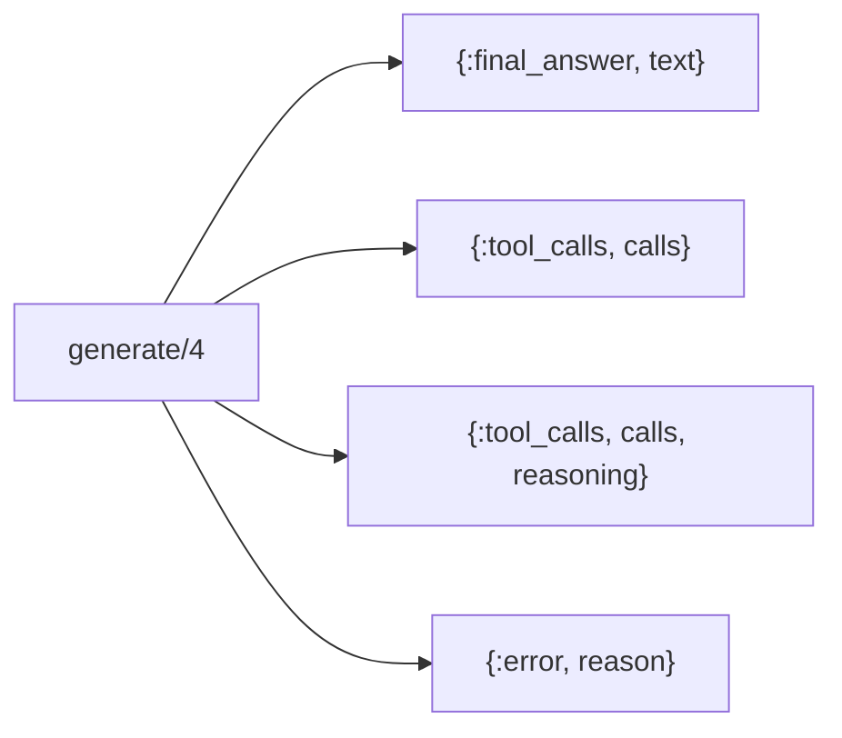
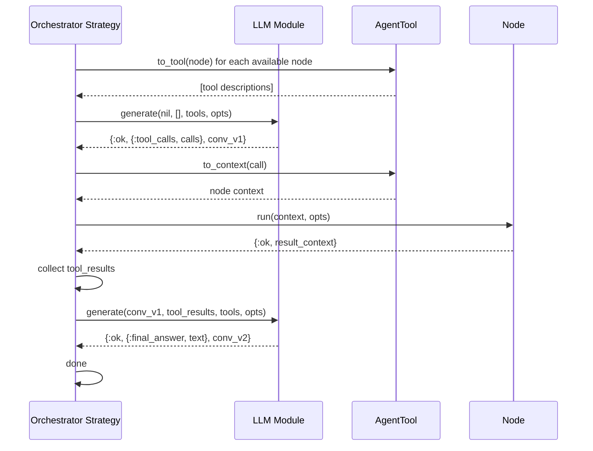
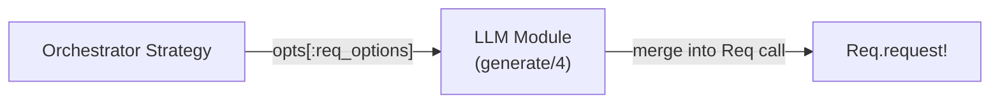

# LLM Behaviour

The LLM Behaviour is an abstract interface for language model integration. Any
module implementing this behaviour can serve as the decision engine for an
[Orchestrator](README.md). This keeps Jido Composer decoupled from any specific
LLM provider.

## Contract

The behaviour defines a single callback:

| Callback     | Input                                   | Output                                                |
| ------------ | --------------------------------------- | ----------------------------------------------------- |
| `generate/4` | conversation, tool_results, tools, opts | `{:ok, response, conversation}` or `{:error, reason}` |

### Parameters

**conversation** (`term()`) — Opaque conversation state owned by the LLM
module. The strategy stores this between calls but never inspects it. Pass
`nil` on the first call.

**tool_results** (`[tool_result()]`) — Normalized results from the previous
round of tool executions. Empty list on the first call.

| Field    | Type         | Description                             |
| -------- | ------------ | --------------------------------------- |
| `id`     | `String.t()` | Tool call ID from the previous response |
| `name`   | `String.t()` | Tool/node name                          |
| `result` | map          | Result map from node execution          |

**tools** (`[tool()]`) — Available tool descriptions in a neutral format
derived from [Nodes](../nodes/README.md) via
[AgentTool](README.md#agenttool-adapter):

| Field         | Type         | Description                        |
| ------------- | ------------ | ---------------------------------- |
| `name`        | `String.t()` | Node name                          |
| `description` | `String.t()` | What the node does                 |
| `parameters`  | map          | JSON Schema for accepted arguments |

**opts** (`keyword()`) — LLM-specific options (model, temperature, max_tokens)
and transport options. The reserved key `:req_options` passes through to the
underlying HTTP client — see [Req Options Propagation](#req-options-propagation).

### Response Types

The callback returns `{:ok, response, conversation}` or `{:error, reason}`.

The `conversation` term is the updated conversation state that the strategy
stores and passes back on the next call. The LLM module manages the full
provider-specific message history internally — building the correct message
arrays, handling argument JSON parsing, encoding tool results in the provider's
format (Claude's `tool_result` content blocks vs OpenAI's `tool` role messages),
and preserving mixed content (text + tool calls).

The `response` is one of:

| Variant                           | Meaning                                                    |
| --------------------------------- | ---------------------------------------------------------- |
| `{:final_answer, text}`           | The LLM has enough information to respond                  |
| `{:tool_calls, calls}`            | The LLM wants to invoke one or more nodes                  |
| `{:tool_calls, calls, reasoning}` | Tool calls with accompanying reasoning text (e.g., Claude) |
| `{:error, reason}`                | Generation failed                                          |

The `reasoning` string in the 3-tuple variant carries the LLM's thinking text
emitted alongside tool calls. Claude routinely returns both text and tool_use
content blocks in the same response; OpenAI typically returns `content: null`
when making tool calls. The strategy may log or discard this text — it does not
affect execution flow.

**Tool call** structure:

| Field       | Type         | Description                                     |
| ----------- | ------------ | ----------------------------------------------- |
| `id`        | `String.t()` | Unique call identifier (for result correlation) |
| `name`      | `String.t()` | Which tool/node to invoke                       |
| `arguments` | map          | Parameters for the node (always a parsed map)   |

Arguments are always a parsed map. The LLM module is responsible for parsing
JSON strings (OpenAI returns `arguments` as a JSON string) and passing through
parsed maps (Claude returns `input` as a map).

## Integration Points

The strategy never constructs provider-specific messages. It passes normalized
tool results to the LLM module, which builds the correct message format
internally (Claude `tool_result` content blocks, OpenAI `tool` role messages,
etc.).

## Conversation State Ownership

The LLM module owns the conversation state. The strategy treats it as opaque:

| Concern                       | Responsibility                                 |
| ----------------------------- | ---------------------------------------------- |
| Message format (per provider) | LLM module                                     |
| Tool result encoding          | LLM module                                     |
| Assistant message echo-back   | LLM module                                     |
| Storing conversation state    | Strategy                                       |
| Passing state between calls   | Strategy                                       |
| Serializing for persistence   | LLM module (via checkpoint callback if needed) |

This design ensures the behaviour works with any provider without leaking
format details into the strategy. A `req_llm` or `jido_ai` package implements
the behaviour and handles all provider-specific encoding/decoding.

### Persistence Consideration

When an orchestrator hibernates (see [Persistence](../hitl/persistence.md)),
the conversation state is checkpointed as part of `__strategy__`. The LLM
module should ensure its conversation state is serializable via
`:erlang.term_to_binary/2`. In practice, conversation state is typically a list
of maps (the provider-specific message array), which serializes natively.

## Req Options Propagation

The `opts` keyword list accepted by `generate/4` supports a `:req_options` key
that LLM implementations merge into their Req HTTP calls. This enables
[cassette-based testing](../testing.md#reqcassette-integration) without any
special test-mode logic in the LLM module or strategy.

| Reserved Key   | Type    | Purpose                                                        |
| -------------- | ------- | -------------------------------------------------------------- |
| `:req_options` | keyword | Merged into `Req.request!/1` options by the LLM implementation |

Within `:req_options`, two keys are particularly relevant:

| Key       | Purpose                                              | Default |
| --------- | ---------------------------------------------------- | ------- |
| `:plug`   | ReqCassette plug for intercepting HTTP calls         | `nil`   |
| `:stream` | Enable/disable streaming (must be `false` for plugs) | `true`  |

The strategy passes `req_options` through opaquely — it never inspects or
modifies them. This keeps the transport concern entirely within the LLM module
and the test setup.

Streaming uses the Finch adapter directly, bypassing the Req plug system.
When `:req_options` includes a `:plug`, the LLM implementation must disable
streaming for that request. This is typically expressed as: if `plug` is set
in req_options, override `stream` to `false`.

## Implementation Requirements

An LLM module needs to:

1. Manage the full conversation history internally (build provider-specific
   message arrays from the conversation state and incoming tool results)
2. Map neutral tool descriptions to the provider's format (Claude's
   `input_schema` vs OpenAI's `function.parameters`)
3. Parse the provider's response into the standard response types (including
   JSON-string argument parsing for OpenAI)
4. Handle provider-specific concerns (API keys, rate limits, retries)
   internally
5. Merge `opts[:req_options]` into outgoing Req calls when present
6. Disable streaming when `opts[:req_options][:plug]` is set
7. Return serializable conversation state (for persistence)

The Orchestrator strategy does not concern itself with provider details. All
provider-specific logic lives inside the LLM module implementation.

## Testing

LLM modules are tested primarily through
[ReqCassette](../testing.md#reqcassette-integration) cassettes that capture
real LLM API responses. This validates parsing, tool call extraction, and error
handling against actual provider response formats.

Cassettes are recorded once against the real API, then replayed in all
subsequent test runs. The `plug:` and `stream: false` options are passed via
`:req_options` to intercept HTTP calls during replay.

For pure strategy logic that does not depend on response shape (e.g., verifying
that the strategy emits the correct directive type), a minimal mock LLM module
returns predetermined responses:

- Return `{:ok, {:tool_calls, [...]}, conv}` to simulate the LLM choosing tools
- Return `{:ok, {:final_answer, "..."}, conv}` to simulate completion
- Return `{:error, reason}` to simulate failures

See [Testing Strategy](../testing.md) for the full testing approach.
