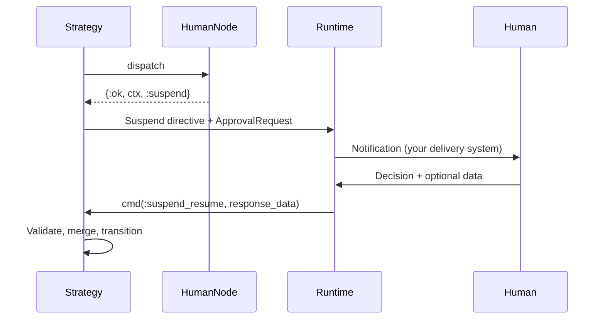
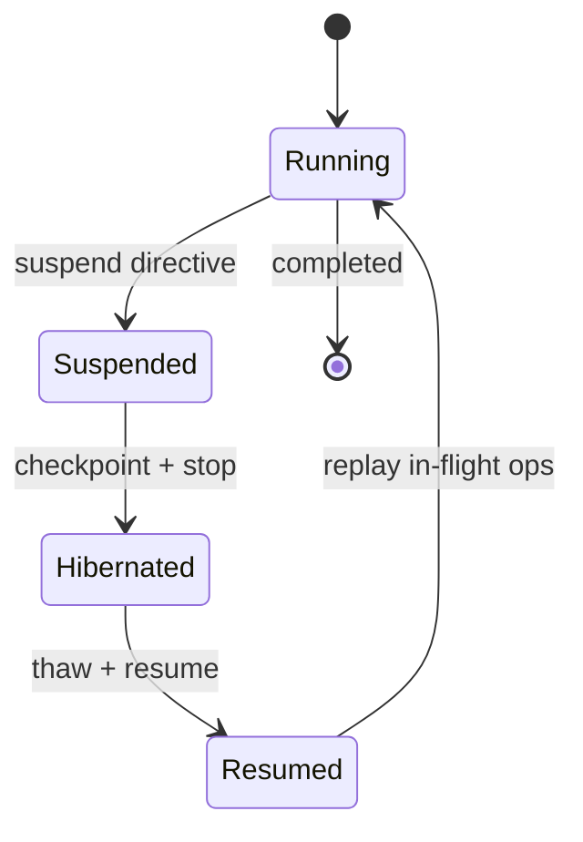

# Human-in-the-Loop

Jido Composer provides two HITL mechanisms: **HumanNode** for workflow gates and **tool approval gates** for orchestrator tools. Both use the same `ApprovalRequest`/`ApprovalResponse` protocol and the generalized suspension system.

## HumanNode in Workflows

HumanNode pauses a workflow at a specific state for a human decision. It always returns `{:ok, context, :suspend}` — suspension is not an error, it's a normal step in the flow.

```elixir
nodes: %{
  process: ProcessAction,
  approval: %Jido.Composer.Node.HumanNode{
    name: "deploy_approval",
    description: "Approve production deployment",
    prompt: "Deploy to production?",
    allowed_responses: [:approved, :rejected],
    timeout: 300_000
  },
  deploy: DeployAction
},
transitions: %{
  {:process, :ok}        => :approval,
  {:approval, :approved} => :deploy,
  {:approval, :rejected} => :failed,
  {:approval, :timeout}  => :failed,
  {:deploy, :ok}         => :done,
  {:_, :error}           => :failed
}
```

When the workflow reaches the `approval` state:

1. HumanNode evaluates the prompt and builds an `ApprovalRequest`
2. Returns `{:ok, context, :suspend}` — the strategy recognizes `:suspend` as reserved
3. The strategy emits a `Suspend` directive with the embedded `ApprovalRequest`
4. Your runtime delivers the request to the human (via your notification system)

### HumanNode Fields

| Field               | Type                 | Default                  | Description                          |
| ------------------- | -------------------- | ------------------------ | ------------------------------------ |
| `name`              | `string`             | required                 | Node identifier                      |
| `description`       | `string`             | required                 | What this approval is for            |
| `prompt`            | `string \| function` | required                 | Question for the human               |
| `allowed_responses` | `[atom]`             | `[:approved, :rejected]` | Valid response options               |
| `response_schema`   | `keyword`            | `nil`                    | Schema for structured response data  |
| `context_keys`      | `[atom] \| nil`      | `nil` (all)              | Which context keys to show the human |
| `timeout`           | `ms \| :infinity`    | `:infinity`              | Decision deadline                    |
| `timeout_outcome`   | `atom`               | `:timeout`               | Outcome when timeout expires         |
| `metadata`          | `map`                | `%{}`                    | Arbitrary metadata for notifications |

### Dynamic Prompts

The `prompt` field can be a function that receives the current context, enabling context-aware questions:

```elixir
%Jido.Composer.Node.HumanNode{
  name: "deploy_approval",
  description: "Approve deployment",
  prompt: fn context ->
    version = get_in(context, [:build, :version])
    env = get_in(context, [:config, :environment])
    "Deploy version #{version} to #{env}?"
  end,
  allowed_responses: [:approved, :rejected]
}
```

## Tool Approval Gates in Orchestrators

Mark individual tools as requiring human approval before execution:

```elixir
use Jido.Composer.Orchestrator,
  nodes: [
    SearchAction,
    {DeployAction, requires_approval: true},
    {DeleteAction, requires_approval: true}
  ]
```

When the LLM calls a gated tool, the orchestrator:

1. Partitions tool calls into gated and ungated
2. Executes ungated tools immediately
3. Suspends with an `ApprovalRequest` for each gated tool
4. Waits for human approval before executing

Ungated sibling tools execute concurrently while the gated tool waits for approval.

### Dynamic Approval Policy

Beyond static `requires_approval`, you can provide a dynamic policy function:

```elixir
use Jido.Composer.Orchestrator,
  nodes: [SearchAction, DeployAction, DeleteAction],
  approval_policy: fn tool_call, context ->
    cond do
      tool_call.name == "deploy" and context[:env] == :prod ->
        {:require_approval, %{reason: "Production deployment"}}
      tool_call.name == "delete" ->
        {:require_approval, %{reason: "Destructive operation"}}
      true ->
        :proceed
    end
  end
```

### Advisory vs Enforcement

| Mechanism                           | Who triggers           | Enforcement | Purpose                                        |
| ----------------------------------- | ---------------------- | ----------- | ---------------------------------------------- |
| HumanNode as orchestrator tool      | LLM decides to call it | Advisory    | LLM asks for help when uncertain               |
| Approval gate (`requires_approval`) | Strategy enforces      | Mandatory   | Dangerous tools require pre-execution approval |

HumanNode as an orchestrator tool is **advisory** — the LLM chooses when to ask. Approval gates are **enforcement** — the strategy always gates execution regardless of what the LLM wants.

### Rejection Handling

When a human rejects a gated tool, the orchestrator injects a synthetic rejection result into the LLM conversation:

```
Tool result for "deploy": REJECTED by human reviewer. Reason: "Too risky."
Choose a different approach.
```

The LLM then adapts its strategy based on the rejection.

**Rejection policy** controls what happens to sibling tool calls:

- `:continue_siblings` (default) — Other tools finish normally; all results (including rejection) go to the LLM

## ApprovalRequest & ApprovalResponse

These serializable structs correlate pending decisions by a unique `id`.

### ApprovalRequest

Built by HumanNode (or the strategy for gated tools), enriched by the strategy with agent context:

| Field               | Source    | Description                               |
| ------------------- | --------- | ----------------------------------------- |
| `id`                | HumanNode | Unique request ID for correlation         |
| `prompt`            | HumanNode | Human-readable question                   |
| `visible_context`   | HumanNode | Context subset the human sees             |
| `allowed_responses` | HumanNode | Valid outcome atoms                       |
| `response_schema`   | HumanNode | Schema for structured input               |
| `timeout`           | HumanNode | Max wait time (ms)                        |
| `timeout_outcome`   | HumanNode | Outcome when timeout fires                |
| `metadata`          | HumanNode | Arbitrary notification metadata           |
| `agent_id`          | Strategy  | Suspended agent's ID                      |
| `agent_module`      | Strategy  | Suspended agent's module                  |
| `workflow_state`    | Strategy  | FSM state name (workflows only)           |
| `tool_call`         | Strategy  | Triggering tool call (orchestrators only) |
| `node_name`         | Strategy  | HumanNode or gated node name              |

### ApprovalResponse

Submitted by external code to resume the flow:

| Field        | Description                                   |
| ------------ | --------------------------------------------- |
| `request_id` | Must match `ApprovalRequest.id`               |
| `decision`   | One of `allowed_responses` atoms              |
| `data`       | Structured input matching `response_schema`   |
| `respondent` | Who responded (opaque — email, user ID, etc.) |
| `comment`    | Optional free-text comment                    |

### Lifecycle



### Validation on Resume

When a response arrives, the strategy validates:

1. `request_id` matches the pending `ApprovalRequest.id`
2. `decision` is in `allowed_responses`
3. `data` conforms to `response_schema` (if defined)

The decision atom becomes the transition outcome (e.g., `:approved` triggers `{:approval, :approved} => :deploy`).

### Resuming a Suspended Flow

```elixir
{:ok, response} = Jido.Composer.HITL.ApprovalResponse.new(
  request_id: approval_request.id,
  decision: :approved,
  respondent: "admin@company.com",
  comment: "Ship it!"
)

{agent, directives} = MyWorkflow.cmd(agent, {
  :suspend_resume,
  %{suspension_id: suspension.id, response_data: Map.from_struct(response)}
})
```

## Generalized Suspension

Suspension extends beyond HITL. Any flow can pause for five reason types:

| Reason              | Use Case                          |
| ------------------- | --------------------------------- |
| `:human_input`      | Approval gates, manual review     |
| `:rate_limit`       | API throttling, backoff           |
| `:async_completion` | Waiting for external async result |
| `:external_job`     | Long-running batch job            |
| `:custom`           | Application-specific reasons      |

```elixir
%Jido.Composer.Suspension{
  id: "susp-123",
  reason: :rate_limit,
  timeout: 60_000,
  timeout_outcome: :timeout,
  resume_signal: "rate_limit_cleared",
  metadata: %{retry_after: 60}
}
```

### Resume API

```elixir
Jido.Composer.Resume.resume(agent, suspension_id, resume_data,
  deliver_fn: &MyApp.deliver_signal/2
)
```

Options:

- `deliver_fn` (required) — `(agent, signal) -> {agent, directives}`
- `thaw_fn` (optional) — `(agent_id) -> {:ok, agent}` for restoring from storage
- `storage` (optional) — Performs CAS (compare-and-swap) on checkpoint status for idempotency

## Persistence

Long-running flows can be checkpointed, hibernated, and resumed across process restarts.



### Resource Management Tiers

| Tier             | Trigger                               | Process alive | Resume latency |
| ---------------- | ------------------------------------- | ------------- | -------------- |
| Live wait        | Suspension starts                     | Yes           | Instant        |
| Hibernate intent | `Suspend.hibernate = true`            | Yes           | Instant        |
| Full checkpoint  | Suspension timeout >= hibernate_after | No            | Thaw + start   |

### Checkpoint

`Jido.Composer.Checkpoint.prepare_for_checkpoint/1` strips non-serializable data (closures, PIDs) and marks the state as `:hibernated`:

```elixir
checkpoint_state = Jido.Composer.Checkpoint.prepare_for_checkpoint(strategy_state)
# Serialize and store checkpoint_state
```

### Thaw

Restore runtime configuration from the DSL definition:

```elixir
restored = Jido.Composer.Checkpoint.reattach_runtime_config(checkpoint_state, strategy_opts)
```

### Resume

Replay in-flight operations and respawn paused children:

```elixir
directives = Jido.Composer.Checkpoint.replay_directives(restored_state)
child_spawns = Jido.Composer.Checkpoint.pending_child_respawns(restored_state)
```

### ChildRef

`Jido.Composer.ChildRef` is a serializable reference to a child process (no PIDs). It tracks the child's module, ID, phase, and status for reliable checkpoint/resume.

| Field            | Description                                                   |
| ---------------- | ------------------------------------------------------------- |
| `agent_module`   | Child's module (for re-spawning)                              |
| `agent_id`       | Child's unique ID                                             |
| `tag`            | Tag for parent-child tracking                                 |
| `checkpoint_key` | Storage key for child's checkpoint                            |
| `suspension_id`  | Links to Suspension causing pause                             |
| `status`         | `:running`, `:paused`, `:hibernated`, `:completed`, `:failed` |

### Idempotent Resume

Checkpoints track status to prevent duplicate resumes:

| Status        | Meaning                  | Transition            |
| ------------- | ------------------------ | --------------------- |
| `:hibernated` | Available for resume     | -> `:resuming`        |
| `:resuming`   | Currently being restored | -> `:resumed`         |
| `:resumed`    | Already restored         | Reject further resume |

### Schema Migration

Checkpoints include a schema version (current: `:composer_v1`). `Checkpoint.migrate/2` handles upgrades from older versions.

### Nesting and Persistence

When nested agents are checkpointed:

1. **Inside-out**: Child hits hibernate threshold -> checkpoints -> emits `composer.child.hibernated` -> parent marks child as `:paused` -> parent checkpoints when its own threshold fires
2. **Top-down resume**: Thaw outermost agent -> re-spawn children from `checkpoint_key` -> children get fresh PIDs -> deliver resume signal to innermost suspended agent -> results propagate up

Parent agents don't know their children are suspended (isolation property). Each level independently manages its own checkpoint/resume cycle.
